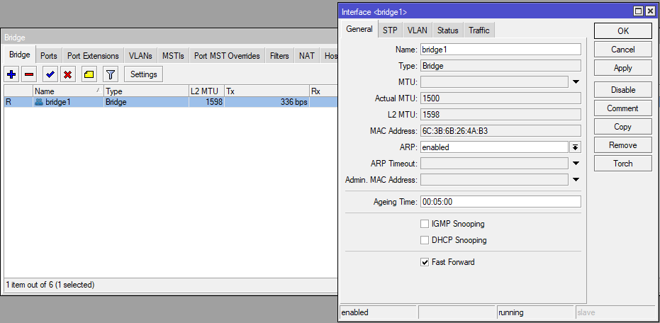
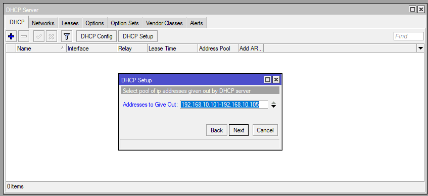

# LAB-18-BRIDGING
Minggu 17 Agustus 2025

# Konfigurasi Bridging  pada  MikroTik
  
  Disini saya akan mengganti internet ether1 menjadi wlan1 dan karna mikrotiknya tidak ada port5 saya akan mulai dari ether1, jadinya akan seperti ini.  
  
1. Buat Bridge LAN di **Bridge > Bridge > Add**.  
  
  
3. Lalu masukan port di **Bridge > Ports > Add**.  
  

4. Buat DHCP Client ke interface yang terhubung ke internet untuk akses internet di **IP > DHCP CLIENT**.  
  
  
5. Buat IP Static untuk interface bridge di **IP > Address**.  
  
  
6. Setup DHCP server untuk interface bridge, dan atur range/pool nya menjadi **192.168.10.101-105** di **IP > DHCP SERVER > DHCP SETUP**.  
  
  
  
  
7. Tambahkan firewall NAT di **IP > Firewall > NAT > add**.  
  
  
8. Aktifkan dan tambahkan DNS google di **IP > DNS**.  
  

10. Ubah IP di Client jadi auto/obtain auto lewat Control Panel.  
  

11. Jika sudah terhubung bisa di setting di winbox  **IP > DHCP Server > Lease > Make static** agar IP yang didapat tetap.  
12. Jika client sudah mendapat IP, coba ping di CMD.  

  
# Kesimpulan
  Konfigurasi bridging pada Mikrotik memungkinkan beberapa interface digabung menjadi satu jaringan lokal yang sama. Dengan bridging, seluruh port dalam bridge dapat berbagi satu segmen IP serta DHCP, sehingga perangkat yang terhubung melalui port mana pun akan memperoleh alamat IP dalam range yang sama.  
